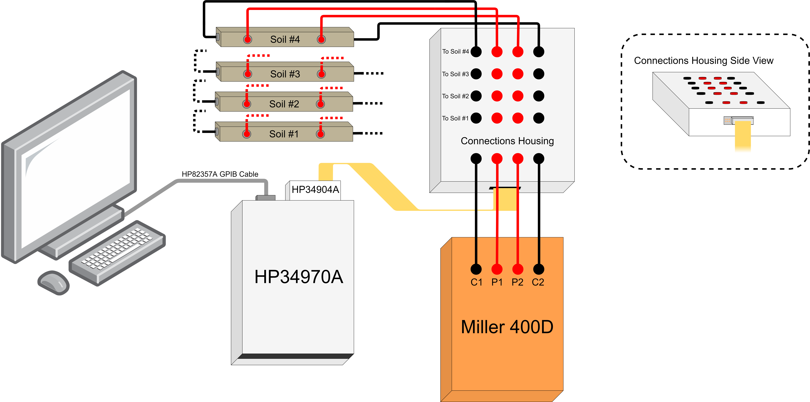

# matrix_switcher
The matrix switcher program uses MATLAB to control an HP34904A switching device housed in an HP34970A switching system. It acts as an automated multiplexer with 4 wires per destination.
## Contents
* Top-Level file: matrix_switcher.m
* Function for looping bwetween soil tubes: switching_loop.m
* Function for setting appropriate relays: set_relay.m
* Sample auto-generated soil log file: soil_log.txt
* Detailed documentation: Matrix_Switcher_Documentation.pdf
## Software Dependencies
This program uses MATLAB with the Instrument Control Toolbox. The Keysight IO Libraries Suite must be installed on the PC to ensure proper connection with the switchng device.
## Hardware Needed:
* HP34970A Switching Device
* HP34904A Relay Card
* HP82357A GPIB Cable
* Miller 400D Resistivity Meter
* Miller 400D Soil Tubes
* Custom-Made Connection Housing
## Diagram

